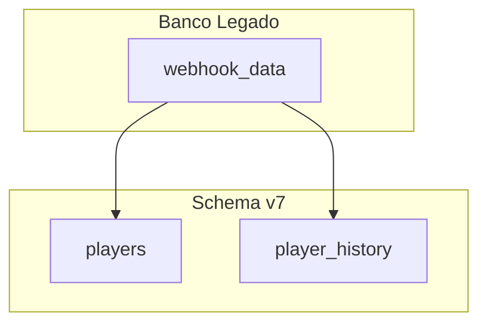

# Diagramas como imagem (mermaid.ink → PNG → ClickUp)

## Regra

Em entregáveis (descrições de tarefa ClickUp, specs, ADRs), **não** incluir blocos ` ```mermaid ` — **exceto** a seção `## Passo a passo sugerido`, que leva **imagem e fonte** para o SuperAgente ([evidencias-dod.md](evidencias-dod.md)).

No restante: sempre gerar **imagem PNG** via API [mermaid.ink](https://mermaid.ink).

O caminho completo:

1. Gerar via mermaid.ink
2. Baixar o PNG
3. Guardar cópia em **space-assets** (backup + markdown local)
4. Na **publicação ClickUp**: anexar o PNG na task e embutir com URL do **attachment** (o script faz isso)

```markdown

```

⚠️ O ClickUp **remove** ou **não renderiza** de forma confiável `` e muitas URLs externas no corpo. O padrão que funciona (igual ao Estruturador de Tarefas) é a URL do attachment. A **fonte Mermaid** no passo a passo da Esteira não é imagem — permanece como bloco de código para o Ritter.

---

## Fluxo obrigatório

### A — Markdown local (`.task/`)

1. Escrever o código Mermaid internamente (flowchart, sequenceDiagram, etc.)
2. Codificar com **base64url** (não base64 padrão — evita 404 por `/` na URL)
3. Montar URL: `https://mermaid.ink/img/{encoded}?type=png&bgColor=!white`
4. Validar que a URL retorna imagem (HTTP 200)
5. Baixar PNG (`render-mermaid.sh` ou `curl`) e push em `space-assets/{projeto}/{task-slug}/diagram-….png`
6. No `.md` local: `` ou `raw.githubusercontent.com/…`
7. **Só no passo a passo da Esteira:** repetir o mesmo código sob o título `Código do diagrama (SuperAgente)`

### B — Publicar no ClickUp

1. `clickup_create_task.py` **anexa** cada PNG (`--attach` ou baixa mermaid.ink/raw)
2. Substitui no corpo a URL da imagem por `` e grava em `markdown_content`
3. `PUT` da descrição
4. **Não** deixar só mermaid.ink / raw.githubusercontent como única fonte de imagem no corpo ClickUp
5. Fonte ` ```mermaid ` da Esteira **não** é reescrita

---

## Script utilitário

```bash
# Gera URL e opcionalmente baixa PNG
~/.cursor/skills/po-techlead-scrum/scripts/render-mermaid.sh "flowchart TD\n  A-->B" diagrama.png
```

Sem arquivo de saída, imprime só a URL.

---

## Codificação manual (Bun/Node)

```typescript
const code = `flowchart TD
  A[Inicio] --> B[Fim]`;

const encoded = Buffer.from(code, "utf8").toString("base64url");
const url = `https://mermaid.ink/img/${encoded}?type=png&bgColor=!white`;
```

---

## Parâmetros úteis da API

| Parâmetro | Exemplo | Uso |
|-----------|---------|-----|
| `type` | `png` | Formato da imagem |
| `bgColor` | `!white` | Fundo claro (melhor para ClickUp) |
| `theme` | `default` | Tema Mermaid |
| `width` | `800` | Largura máxima |

Endpoint SVG (se precisar vetor): `https://mermaid.ink/svg/{encoded}`

---

## Quando usar diagrama

- Fluxos de migração ou integração
- Sequência de eventos (register → checkout → deposit)
- Arquitetura de módulos/tabelas
- Decisões com múltiplos caminhos

Manter diagramas simples — evitar mais de ~15 nós por imagem.

---

## Sintaxe Mermaid (referência rápida)



O código acima é o que se cola **somente** no passo a passo da Esteira (além da imagem). Nos outros diagramas e em Imediatas: **não** colar — só a PNG.

---

## Checklist do diagrama

- [ ] Imagem gerada via mermaid.ink (não só Mermaid no chat)
- [ ] PNG baixado + push em space-assets (markdown local)
- [ ] No ClickUp: PNG **anexado** + URL de attachment no corpo (o script faz isso)
- [ ] URL mermaid.ink validada (200 OK) na geração
- [ ] `bgColor=!white` para legibilidade
- [ ] Legenda `alt` descritiva no Markdown
- [ ] Bloco ` ```mermaid ` na descrição **só** no passo a passo da **Esteira** (imagem + fonte). Imediatas: só a PNG.
- [ ] Nenhum `mermaid.ink` solto como **única** fonte de imagem no corpo ClickUp publicado
