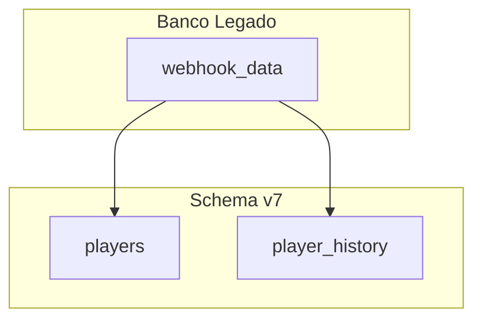

# Diagramas como imagem (mermaid.ink)

## Regra

Em entregáveis (descrições de tarefa ClickUp, specs, ADRs), **nunca** incluir blocos ` ```mermaid `.

Sempre gerar **imagem PNG** via API [mermaid.ink](https://mermaid.ink) e inserir com sintaxe Markdown:

```markdown

```

---

## Fluxo obrigatório

1. Escrever o código Mermaid internamente (flowchart, sequenceDiagram, etc.)
2. Codificar com **base64url** (não base64 padrão — evita 404 por `/` na URL)
3. Montar URL: `https://mermaid.ink/img/{encoded}?type=png&bgColor=!white`
4. Validar que a URL retorna imagem (HTTP 200)
5. Inserir na descrição da tarefa como `` — **não** colar o código Mermaid

---

## Script utilitário

```bash
# Gera URL e opcionalmente baixa PNG
~/.cursor/skills/po-techlead-scrum/scripts/render-mermaid.sh "flowchart TD\n  A-->B" diagrama.png
```

Sem arquivo de saída, imprime só a URL.

---

## Codificação manual (Bun/Node)

```typescript
const code = `flowchart TD
  A[Inicio] --> B[Fim]`;

const encoded = Buffer.from(code, "utf8").toString("base64url");
const url = `https://mermaid.ink/img/${encoded}?type=png&bgColor=!white`;
```

---

## Parâmetros úteis da API

| Parâmetro | Exemplo | Uso |
|-----------|---------|-----|
| `type` | `png` | Formato da imagem |
| `bgColor` | `!white` | Fundo claro (melhor para ClickUp) |
| `theme` | `default` | Tema Mermaid |
| `width` | `800` | Largura máxima |

Endpoint SVG (se precisar vetor): `https://mermaid.ink/svg/{encoded}`

---

## Quando usar diagrama

- Fluxos de migração ou integração
- Sequência de eventos (register → checkout → deposit)
- Arquitetura de módulos/tabelas
- Decisões com múltiplos caminhos

Manter diagramas simples — evitar mais de ~15 nós por imagem.

---

## Sintaxe Mermaid (referência rápida)



O código acima é só para **gerar** a imagem — **não** colar na tarefa final.

---

## Checklist do diagrama

- [ ] Imagem gerada via mermaid.ink (não Mermaid inline)
- [ ] URL validada (200 OK)
- [ ] `bgColor=!white` para legibilidade no ClickUp
- [ ] Legenda `alt` descritiva no Markdown
- [ ] Nenhum bloco ` ```mermaid ` na descrição entregue
