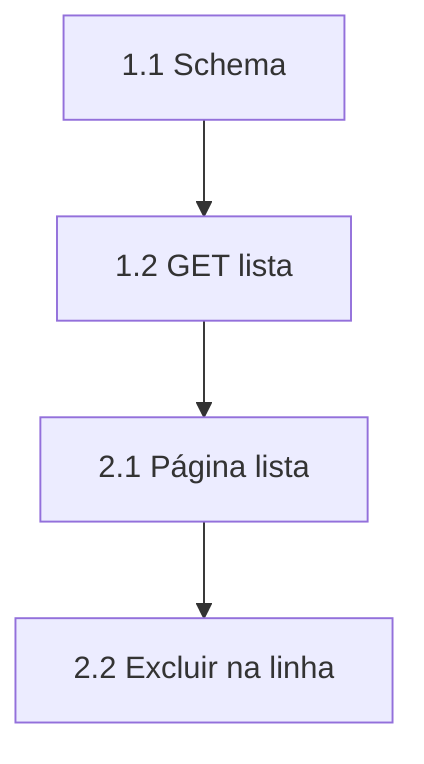

# REGRAS DE DDD e passo a passo (genérico)

**DDD** = Definição de Done: o que é **obrigatório** para chamar a entrega de pronta. Não é Domain-Driven Design. Não listar status de board.

Vale para **Esteira e Imediatas**. Imediatas: cada prova **nomeada**; sem “testa depois do merge” (caminho até `main` é mais curto).

**Quebra do trabalho não é a mesma:**

| Lista | Quem lê | Como vira “tarefa” |
| --- | --- | --- |
| **Esteira** | SuperAgente Ritter | `## Passo a passo sugerido` com PBI + Espera/Bloqueia |
| **Imediatas** | O **dev** | **Checklist nativo do ClickUp** na tarefa principal de cada dev. **Proibido** tabela PBI / Espera / Bloqueia / “Dependência”. **Proibido** `- [ ]` no markdown no lugar disso |

HML trata-se como **1:1 com `main`**, inclusive banco — ver constituição `../docs/git-fluxo.md`.

---

## `## REGRAS DE DDD` (obrigatório em toda task)

O PO preenche **casos desta entrega** (repos do workspace). A skill só define o molde. Exemplos abaixo são fictícios (listagem / GET) — **não** copiar nome de produto.

**Tom do DDD = ordem de execução.** O executor **faz** (login, clique, Network, banco). Não escrever “Imagine que o expert está logado”. Escrever **“Faça login como Expert (token Admin) no dashboard de HML. Em seguida: …”**. Dado/Quando/Então continua: é o roteiro do teste, não um conto.

Proibido no DDD: hipotético, “cenário mental”, “o QA imagina”. Obrigatório: verbo no imperativo no topo de cada bloco (Faça / Abra / Dispare / Confirme / Grave / Anexe).

### 1. Pronto desta entrega

Comportamento verdadeiro em **HML**, não “arquivo X commitado”.

Escreva o pronto como **o que executar**:

- **Faça login** no papel certo (Admin, Player, anônimo) no ambiente de HML desta spec.
- Front: **abra** a tela/fluxo, complete o caminho feliz (+ empty/erro se a spec pediu).
- Back: **chame** o contrato; a resposta bate com o Apidog / curls da spec.

Exemplo fictício (não copiar produto):

**Faça login** como Admin no dashboard de HML.

- **Dado** a lista da spec
- **Quando** você aplica o filtro
- **Então** a query vai na API (Network), não `.filter` no client.

### 2. Paralelos (o que não pode quebrar)

Listar superfícies que compartilham **rota, service, tipo, header ou nome parecido**. Tipagem compartilhada e “função que não precisava mexer” entram aqui.

**Confirme em HML, uma a uma.** Se a spec muda o GET da listagem: **abra** o modal da mesma área, **abra** o sino de **outro** módulo, **confira** se um type compartilhado em dois clients quebrou. Cada superfície listada = item de regressão que o executor **roda**, não um parágrafo de “cuidado”.

### 3. Prova (anexar na task quando a entrega for validada em HML)

| Camada | O que anexar |
| --- | --- |
| FRONT | Gravação do fluxo em HML + o que fez e como testou |
| BACK | Prova em HML (contrato/curl) + doc se a spec pediu (Apidog, `.env.example`) |
| Front+Back | Os dois |

Imediatas: uma linha de prova por item do “pronto” **da camada que altera código**; nada de “cobre no QA depois”.

### Prova na camada que mudou (não na que só consome)

Contar superfícies **e** quem mexe no código:

| Situação | Quem anexa a prova |
| --- | --- |
| Front **altera** tela, campo, handler, copy, estado de erro | `P-FRONT-n` (gravação) |
| Front **zero** alteração nessa superfície (tela já existe, payload igual, sem handler novo) | **Não** cria `P-FRONT`. Quem mudou a API / o gateway anexa `P-BACK-n` |
| Back muda contrato que o Front **também** ajusta (ex. message de 400 que o app precisa mostrar) | Os dois: Back prova o 400; Front prova a message visível |

**Proibido:** mandar o Front gravar regressão de uma tela em que ele **não** vai commitar nada. “Não mexer no dash” ≠ “abre o dash e anexa vídeo”. Isso vira prova do Back (curl / Postman / HML na rota que o dash já chama).

Antes de fechar as linhas `P-*`: listar cada `BE-n` / `FE-n` e cada bloco do Pronto. Cada um mapeia para **uma** prova da **mesma** camada. Sobra de Pronto Front sem `P-FRONT` **só** é válida se aquele bloco for “zero código Front” — nesse caso o Pronto vai para o Back e a prova é `P-BACK`.

---

## Esteira — `## Passo a passo sugerido` (PBI + dependência)

**Só Esteira.** O Ritter precisa disto para gerar PBI/Task e linkar Dependência.

Imediatas: **não** incluir esta seção. Ver [clickup-task-guide.md](clickup-task-guide.md#imediatas--checklist-nativo-do-clickup).

Uma **tabela = um PBI**. Uma **linha = uma Task**. IDs `PBI.item` (`1.1`, `2.3`).

Cinco colunas (ClickUp não aguenta sete):

| Nº | Camada | Task | Espera | Bloqueia |
| --- | --- | --- | --- | --- |
| 1.1 | BACK | Schema / migration | - | 1.2, 2.1 |
| 1.2 | BACK | GET da listagem (página e filtro no servidor) | 1.1 | 2.1 |
| 2.1 | FRONT | Página de lista | 1.2 | 2.2 |

**Por quê** (abaixo da tabela, não em coluna extra):

- **1.1** bloqueia 1.2 e 2.1: sem coluna o GET e a tela não existem
- **1.2** espera 1.1: SELECT nas colunas novas · bloqueia 2.1: a tabela do dash consome este JSON
- **2.1** espera 1.2: sem GET não há o que renderizar

PBI minúsculo (≤3 linhas): pode omitir “espera: —” óbvio se o título da Task já diz o recorte.

### Vínculos

- Espera / Bloqueia = **só IDs**. Proibido “todos abaixo”.
- `-` quando vazio. Quem aparece em Bloqueia de `1.1` tem que listar `1.1` em Espera.
- Camada só `BACK` ou `FRONT`. PBI mista: as duas na mesma tabela (ainda no limite de linhas).
- Título `#### PBI 1 — …`. Separar PBIs com `---`. Sem `#####` / `######` (ClickUp minúsculo).

### Quando ficar grande

- Máximo **~6 linhas** por tabela. Passou → **dois PBIs** (ex.: “Lista” e “Ações da lista”).
- **4+ PBIs:** quadro-resumo no topo (`PBI | espera | uma linha`) + mermaid.
- Task ClickUp só Front ou só Back: **só as linhas daquela camada**. MASTER leva o passo a passo inteiro.

### Mermaid (exceção: esta seção)

1. **Imagem** mermaid.ink — humano.
2. **Fonte** em `Código do diagrama (SuperAgente)` — o Ritter parseia o código, não a PNG.

Outros diagramas da task: só imagem ([diagrams.md](diagrams.md)).

Exemplo de fonte (fictício):



`2.2` espera `2.1` (o botão mora na tabela) **e** o DELETE do Back, se existir — declarar os dois IDs na grade.

### Quadro-resumo (4+ PBIs)

| PBI | Espera | Em uma linha |
| --- | --- | --- |
| 1 Fundação Back | — | Schema + GET |
| 2 Lista | 1 | Tabela e paginação |
| 3 Form | 1 e 2 | Criar espera POST; editar espera GET :id e o lápis na lista |

---

## `## ⛔ NÃO DEVE` (obrigatório no FINAL da task)

Último `##` da spec. Vai **depois** de Observações (e depois de Referência visual, se a visual ainda não tiver sido colocada antes). O júnior lê isto por último.

**Para quê:** anti-critérios. Se qualquer linha for verdade, a entrega **não** está pronta — mesmo que o caminho feliz “pareça ok”. Não misturar com Critérios de Aceitação nem com Observações (risco ≠ proibição).

**Como preencher:** casos **desta** entrega. Tom professor na 2ª coluna (o *porquê* em uma frase). Não copiar a tabela de outra task. Não enxugar.

**Mínimo:** 5 linhas Front+Back; 3 uma camada. Incluir sempre, se o escopo pedir:

- visual (repo atual > DS só no buraco > mock só campos/ações) quando houver Front / protótipo
- o que misturar (rota, type, módulo com nome parecido)
- o contrato que o time fechou (verbo, path, payload legado)
- o paralelo que não pode quebrar
- prova só em localhost / sem HML

**O que não entra:** passo de implementação, “não esquecer de commitar”, meta de Scrum, path `.task/` do PO.

### Destaque no ClickUp (módulo com fundo)

A API (`markdown_description`) **não** cria Banner (`/banner` / `/info`). O que a API pinta como bloco destacado é o **blockquote** (`>`): barra + fundo do quote — o “módulo colorido” que sobrevive à publicação.

Envolva **só** o aviso de bloqueio e a frase de ouro em `>`. A **tabela fica fora** do quote (tabela dentro de `>` quebra no ClickUp).

Proibido: `:::danger`, `> [!CAUTION]`, HTML com `background`. A API não converte isso em Banner; o literal aparece feio.

Opcional depois de publicar: no editor, selecionar o quote → Turn into → Banner. Não é obrigatório na spec local.

### Formato (copiar e preencher)

```markdown
## ⛔ NÃO DEVE

> **BLOQUEIO.** Se qualquer linha abaixo for verdade, a entrega **não** está pronta — mesmo que o caminho feliz “pareça ok”. Não negociar. Não “quase pronto”.

| Se isto acontecer | Por que é falha |
| --- | --- |
| (ação concreta desta spec) | (uma frase: o que quebra / a regra que o time fechou) |

> **Frase de ouro.** (1–2 frases do “pronto de verdade” desta entrega.) Qualquer linha da tabela = **não** está pronto.
```

### Exemplo fictício (não copiar produto)

| Se isto acontecer | Por que é falha |
| --- | --- |
| Copiar cor, glow ou radius do mock no dash | O repo já tem chrome. Mock só dita campos/ações. |
| Trocar o tema do produto “porque o DS é outro” | Repo atual prevalece até o PO mandar mudar. Ordem: repo → DS (buraco) → mock. |
| Lista filtrar no client em vez de query na API | KPI e página mentem com volume. |
| Front de A consumir o GET de B e “filtrar” | Dois papéis no mesmo path = duas operações. |
| Prova só em localhost, sem HML | HML = `main` + banco. |
