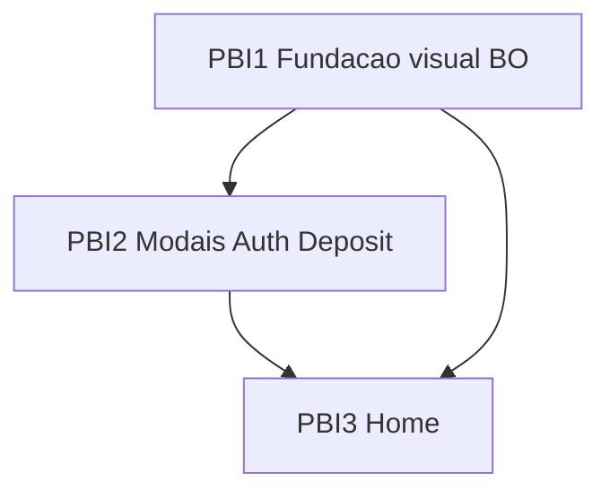

> ⚠️ **Conteúdo gerado / assistido por IA.** Revise antes de executar ou publicar.

# Aplicar Design System PixReals no player (modais → Home) — SpaceSoft Home

| Campo | Valor |
|-------|--------|
| **Projeto** | SpaceSoft games |
| **Camadas** | Frontend |
| **Repositório Frontend** | https://github.com/Space-Software-LTDA/space-spacesoft-home |
| **Stack** | Laravel + Vue 3 + Vite + Tailwind + Pinia (legado — **não** migrar para Next nesta entrega) |
| **API (Front)** | Já existente no repo (`client/services/api.ts`). **Sem** endpoint novo nesta task. |
| **`.env.example`** | Sem keys novas obrigatórias. Tema/logo/banners vêm do backoffice via `script#configs` + CSS vars em `resources/views/app.blade.php`. |
| **Protótipo (hierarquia/ações)** | https://aesthetic-play-hub.lovable.app · id-preview https://id-preview--6c770339-3b36-499a-b653-775cb70dab53.lovable.app (commit visual Align ~`2a1ca8a` / r5) |
| **Régua visual do produto (obrigatória)** | **Design System PixReals `0.2.1-apply-mini-a`** — anexos `DESIGN_SYSTEM.md` + `tokens.dtcg.json` (ver §1.1). Patterns `P-…`. **Hex de marca no DS = exemplo;** no player **cores/logo/banners/ícones/font = backoffice.** |
| **Contrato API (Apidog)** | N/A — Front-only, sem rota nova |

---

## 1. Contexto

O player **SpaceSoft Home** (`space-spacesoft-home`) já é um cassino B2C white-label: cores, logo, favicon, fonte, radius, banners de home e banners de login/cadastro/depósito vêm do **backoffice** (injetados no Blade + Pinia `global`).

Foi forjado e aplicado (Forge → Apply → ALIGNED + mini-A) um **Design System do produto PixReals** com protótipo Lovable: Primary sólido no Cadastro, auth em sheet/dialog, depósito PIX, jackpot com lista **contextual** de ganhadores (`P-JACKPOT-WINNERS`), Home densa sem neon.

**Esta entrega:** aplicar no Vue a **hierarquia, densidade e patterns `P-…` desse DS** (não “inventar de olho no print”), na ordem:

1. Fundação (shell de Modal / Button / Input / surfaces) — sem quebrar tema BO  
2. **Popups primeiro:** Login → Cadastro → Depósito  
3. **Depois a Home** (chrome, hero, jackpot+winners, rows, maiores ganhos, providers, footer)

### 1.1 Documentação do Design System (ler antes de codar — obrigatório)

> Sem o DS anexo, o júnior só tem o Lovable e tende a copiar hex/glow. **O DS é a régua; o protótipo é a evidência visual.**

| Artefato | Versão / nota | Para que serve nesta task |
|----------|---------------|---------------------------|
| **`DESIGN_SYSTEM.md`** | **`0.2.1-apply-mini-a`** | Lei: F1–F8, componentes, **`P-AUTH`**, **`P-DEPOSIT`**, **`P-CHROME-*`**, **`P-BONUS-STRIP`**, **`P-JACKPOT`**, **`P-JACKPOT-WINNERS`**, **`P-WINS`**, **`P-GAMECARD`**, anti-padrões, checklist §15 |
| **`tokens.dtcg.json`** | Espelho F1–F8 | Nomes de token / escala; no player mapear para CSS vars do **BO** (não gravar `#CFA551` como Primary fixo) |
| **`EXTRACTION_NOTES.md`** | Forge + Apply + Mini-A | Decisões humanas (dual header+FAB Primary, warning, Inter, jackpot nested) e o que foi rejeitado |
| **`2026-09-21-pixreals-r5.md`** | Re-QA pós mini-A | Último relatório visual Align (jackpot + winners contextual). Útil para “o que já passou no preview” |
| (opcional) `…-r4.md` | ALIGNED pré-lista no jackpot | Contexto histórico; **não** usar como lei se divergir do `0.2.1` |

**Local no workspace do PO (não colar path no ClickUp):** pasta `.docs/` do produto — `DESIGN_SYSTEM.md`, `tokens.dtcg.json`, `design-system-forge/EXTRACTION_NOTES.md`, `design-system-forge/QA_REPORTS/2026-09-21-pixreals-r5.md`.

**Na publicação ClickUp:** anexar no mínimo `DESIGN_SYSTEM.md` + `tokens.dtcg.json` (+ `EXTRACTION_NOTES.md` e `2026-09-21-pixreals-r5.md` se couber). No corpo publicado, citar pelo **nome do arquivo** (“leia o anexo `DESIGN_SYSTEM.md` versão 0.2.1-apply-mini-a”), **sem** path `.docs/`.

**Como usar o DS com backoffice:**

| O DS manda | O BO manda |
|------------|------------|
| Patterns `P-…`, nested, sheet vs dialog, 1 CTA primary por seção, dual header+FAB, jackpot nested vs Maiores ganhos global, anti-glow | Valor de `--primary-color`, `--bg-color`, `--surface-color`, `--border-radius`, `--font`, logo, favicon, todos os banners |

O `#CFA551` no DS/PixReals é **marca do protótipo de referência**, não a cor do tenant SpaceSoft.

### Glossário

| Termo | O que significa |
|-------|-----------------|
| **Backoffice (BO)** | Painel que configura o site: `primary_color`, `bg_color`, `surface_color`, `border_radius`, `font`, logo, favicon, banners, `login_banner`, `register_banner`, `deposit_banner`, etc. |
| **CSS vars do tema** | Variáveis no `:root` geradas no Blade: `--primary-color`, `--primary-color-contrast`, `--bg-color`, `--surface-color`, `--border-radius`, `--font`. O Tailwind já mapeia `bg-primary`, `bg-background`, `bg-surface`, `rounded-custom`. |
| **Primary dinâmico** | A cor de marca **não** é `#CFA551` fixo no código. No protótipo o dourado é **exemplo**. Em produção o Primary é `rgb(var(--primary-color) / …)` vindo do BO. |
| **P-… / DS PixReals** | Patterns e regras do anexo `DESIGN_SYSTEM.md` **0.2.1-apply-mini-a**. Ex.: `P-AUTH`, `P-DEPOSIT`, `P-JACKPOT-WINNERS`. |
| **Protótipo Lovable** | Referência de **layout, hierarquia, espaçamento, estados e ações**. Não é fonte de hex/logo/banner nem substitui o DS. |
| **Sheet** | Modal mobile que sobe de baixo (`items-end`, handle). Desktop = dialog central. |
| **Nested / surface-2** | Preenchimento interno de card/modal um passo acima do fundo — **não** usar o mesmo `background` da página dentro do card. |
| **Prova social global vs contextual** | Global = painel “Maiores ganhos” (ou ticker — **não os dois**). Contextual = lista de últimos ganhadores **dentro** do card Jackpot. |

### Por que o backoffice manda na marca

Cada cliente SpaceSoft pode ter Primary verde, roxo, dourado, etc. Se o Front hardcodar o gold do Lovable, **todos os clientes ficam PixReals** e o BO deixa de funcionar.  
Por isso: **patterns do DS (`DESIGN_SYSTEM.md`) + estrutura do Lovable + tokens de marca do BO**.

---

## 2. Objetivo

Player Vue alinhado ao **DS PixReals 0.2.1-apply-mini-a** (modais → Home), **mantendo 100% a theming do backoffice**. Entrega pronta em HML com prova Front.

### 2.1 Lacuna de ambiente (subtarefa — depois da UI)

Hoje **não há Dockerfile** nem **manual decente de instalação/deploy** nos projetos. O player **precisa rodar com Docker**.

**Depois** desta entrega visual (modais → Home), executar a subtarefa:

- https://app.clickup.com/t/86aknb85w — **Docker + README** em **Home**, **Backoffice** e **Partners**: **`Dockerfile` no EasyPanel** + `README.md` operacional; banco/cache como **serviço separado**.

---

## 3. Prioridade visual (obrigatória — não inverter)

| # | Fonte | O que manda |
|---|--------|-------------|
| 1 | **Repo + backoffice** | `primary_color`, `bg_color`, `surface_color`, `border_radius`, `font`, logo, favicon, `banners*`, `login_banner`, `register_banner`, `deposit_banner`, `website_name`. Já injetados em `app.blade.php` + `global` store. |
| 2 | **DS PixReals / Space DS** | Hierarquia, density, nested, patterns `P-…`, anti-glow, Cadastro = Primary **sólido** (usando a cor BO), par Entrar/Cadastrar alinhado, sheet mobile, etc. |
| 3 | **Protótipo Lovable** | Campos, ordem, ações, anatomia de tela. **Nunca** hex, glow, neon, logo estática do mock ([AP-FE-08](anti-padrões)). |

**Exemplo:** no protótipo o Primary é dourado `#CFA551`. No código use `bg-primary` / `text-primary` / `rgb(var(--primary-color))`. Se o BO setar `#3FC168`, o mesmo botão fica verde — e isso está **certo**.

---

## 4. Alterações Necessárias

### Frontend

**Visual (não inverter):** (1) chrome/tema **deste** repo + backoffice · (2) **anexo `DESIGN_SYSTEM.md` 0.2.1-apply-mini-a** (+ `tokens.dtcg.json`) · (3) protótipo Lovable = campos/hierarquia/ações — zero neon/glow/hex de marca.  
Constituição Space (`design-system.md` / `ui-gosto`) só preenche buraco — **não** resumir 19 seções na task; o júnior abre os anexos.

**Ordem de implementação preferida (o Ritter espelha no passo a passo):** fundação → modais (Cadastro/Login/Depósito) → Home. Abaixo está o **escopo contínuo** da entrega — **não** é a quebra em PBI (isso só em `## Passo a passo sugerido`).

#### 4.0 Regra de ouro do tema (ler antes de qualquer PR)

**Faça:**

- Continuar lendo configs de `script#configs` → `useGlobalStore().init()`  
- Usar classes Tailwind `bg-primary`, `text-primary-contrast`, `bg-background`, `bg-surface`, `rounded-custom`  
- Renderizar `global.logoURL`, `imgBaseUrl(global.register_banner?.image)`, `login_banner`, `deposit_banner`, banners da Home  
- Manter fluxos de API existentes (`auth.register`, `/auth/login`, `/wallet/add-credit`, etc.)

**Não faça:**

- Hardcodar `#CFA551`, `#0C1015` ou qualquer hex do Lovable como Primary/Background “definitivo”  
- Trocar logo/banner do BO por asset estático do protótipo  
- Remover ou ignorar `--primary-color` / `--bg-color` / `--surface-color` do Blade  
- Quebrar `Button.vue` primary que já usa `bg-primary`  
- Introduzir segundo sistema de tema paralelo ao BO

Se precisar de **novas** superfícies (ex. `surface-2`, `muted`, `success`, `warning`, `destructive`):

- Preferir **derivar** de tokens existentes (`primary`/`surface`/`bg`) ou mapear a partir de `colors` do BO se já existirem no payload  
- Se inventar CSS var nova, documentar no PR e garantir fallback; **não** substituir o Primary do BO  
- Success/live/destructive podem ser tokens semânticos fixos (acessibilidade) **desde que** não concorram com o Primary de marca do BO

#### 4.1 Fundação visual (shell)

Arquivos típicos: `client/global.css`, `tailwind.config.js`, `client/components/Modal.vue`, `Button.vue`, `Input.vue`, eventualmente tokens utilitários.

1. **Surfaces / nested**  
   - Escala perceptível: background (página) → surface/card → nested interno (`surface-2` ou equivalente).  
   - Nested **nunca** = mesmo fill da página dentro do modal.  
   - Sem glow, neon, glass decorativo no chrome ([AP-FE] / gosto).

2. **Modal.vue**  
   - Desktop (`sm+`): dialog central, radius coerente com `--border-radius` / `rounded-custom-max`, overlay escuro.  
   - Mobile: comportamento **sheet** (ancorado embaixo, handle opcional, full-width, close ≥ 44px touch).  
   - Close acessível; Escape fecha (já existe — manter).  
   - Remover poço vazio / padding exagerado tipo marketing SaaS.

3. **Button.vue**  
   - Variant **primary** = sólido `bg-primary` + `text-primary-contrast` (já quase assim).  
   - Variant **outline** para Entrar / secundários: mesma **altura** e radius do primary (par alinhado idle+hover).  
   - Evitar `active:scale-95` se desalinha o par; hover sem “pulo” de box.  
   - Remover gradient teatral `from-black/15 to-white/15` se competir com a marca (preferir flat primary).

4. **Input.vue**  
   - Altura alvo ~40px (`h-10`); radius alinhado ao botão.  
   - Labels legíveis; erro inline; sem Roboto solto diferente do form.

#### 4.2 Modais — Cadastro, Login e Depósito

Arquivos: `RegisterModal.vue`, `LoginModal.vue`, `DepositModal.vue`, `DepositForm.vue`, `DepositQRCodeScreen.vue`, `DepositSuccessScreen.vue`, store `modals.ts`.

Entregar **antes** da Home (prioridade de negócio).

##### Cadastro (`RegisterModal`) — P-AUTH

- Manter campos e validação Zod / API atuais (não inventar contrato).  
- Hierarquia visual do protótipo: segmented Entrar/Cadastrar se o produto já navega entre modais; **1 CTA primary** sticky no footer (“Criar conta…”).  
- **Banner:** `global.register_banner` via `imgBaseUrl` — se null, layout sem poço (não placeholder fake do Lovable).  
- **Logo:** `global.logoURL`.  
- Mobile = sheet; desktop = dialog (split arte/banner só se o banner BO existir e couber sem poço).  
- Google: mesmo envelope tipográfico do form; respeitar `google_login_enabled`.  
- Captcha Turnstile: manter.

##### Login (`LoginModal`) — P-AUTH

- Espelhar densidade do Cadastro (par visual).  
- Banner: `global.login_banner`.  
- CTA primary único; link “esqueci senha” / abrir `ForgotPasswordModal` sem segundo primary.  
- Fluxo pós-login (deposit query, notify) **intacto**.

##### Depósito (`DepositModal` + form/PIX) — P-DEPOSIT

- Só PIX (já é o fluxo).  
- Chips de valor alinhados; chip “Popular” **inline** sem cortar label; default alinhado ao BO (`deposit.min_amount` / regras atuais — não forçar R$ 50 se o BO/min for outro).  
- Banner: `global.deposit_banner` + flag `deposit.show_bonus_banner` se existir.  
- Nested surface nos cards internos; footer sticky com CTA “Depositar via PIX” / “Copiar código” em **primary** (cor BO).  
- Passos form → QR → success: manter polling `/wallet/deposits/:id/status`.  
- Mobile sheet; desktop dialog.

#### 4.3 Home

Arquivos típicos: `Header.vue`, `HeaderMobile.vue`, `BottomNavigation.vue`, `TopMessage.vue`, `Hero.vue`, `Sidebar.vue`, jackpot (criar/ajustar componente se não existir card dedicado), `TopWinners.vue`, `GameListSection.vue`, `GameListItem.vue`, `ProvidersSection.vue`, `HomeRecomendations.vue`, `Footer.vue`, páginas casino/home.

Entregar **depois** dos modais estáveis.

1. **Chrome deslogado**  
   - Desktop: Entrar outline + **Cadastrar primary sólido** (cor BO).  
   - Mobile: Cadastrar primary no header; FAB central “Cadastre-se” **mesmo variant primary** (exceção dual já decidida no DS).  
   - Depositar ícone (success-soft ou equivalente) abre depósito.  
   - Logo = `global.logoURL` (nunca asset Lovable).

2. **Faixa / TopMessage** (`P-BONUS-STRIP` se aplicável)  
   - Fill **primary** (BO); CTA interno **inverso** (fundo página/surface + texto primary) — não segundo botão solid primary competindo.  
   - Texto/conteúdo do BO (`top_bar_text` / banners conforme já usado).  
   - Dismissível; máx. 1 faixa.

3. **Hero**  
   - Carrossel a partir de `global.banners` / empilhados — **imagens do BO**.  
   - Sem HTML chip solto sobre a arte; carrossel discreto.

4. **Jackpot + últimos ganhadores** (`P-JACKPOT` + `P-JACKPOT-WINNERS`)  
   - Card único; valor destacado.  
   - Lista **contextual** de últimos ganhadores **dentro** do card (abaixo do bloco título/valor), estática, legível — **sem** marquee full-bleed sob o Header.  
   - Dados: usar fontes já existentes no Home (`top_winners` / APIs atuais). Se faltar endpoint, UI com empty quieto — **não** inventar API nesta task (subir dúvida ao PO).

5. **Rows de jogos / cards** (`P-GAME-ROW`, `P-GAMECARD`)  
   - Densidade cassino; tile clicável; skeleton surface; hover “Jogar” só desktop.  
   - Badges ≤ 2.

6. **Maiores ganhos** (`P-WINS`) — prova social **global**  
   - Manter/ajustar `TopWinners.vue`.  
   - **Não** remountar ticker global sob o header se o painel existir.

7. **Providers / Footer**  
   - Logos provedores; footer estruturado + responsável/+18 conforme já houver.

#### 4.4 Fora de escopo (esta entrega)

- Migrar para Next.js / boilerplate FDD  
- Admin / backoffice UI  
- Endpoints novos  
- KYC/Saque redesign completo (só não quebrar)  
- Copiar badge “Made with Lovable”

---

## 5. Critérios de Aceitação

### Frontend

**Dado** o anexo `DESIGN_SYSTEM.md` versão **0.2.1-apply-mini-a**  
**Quando** implemento auth, depósito, chrome ou jackpot  
**Então** o comportamento segue os `P-…` citados (não só “parece o print”), com Primary/logo/banners vindos do BO.

**Dado** um tenant com Primary configurado no BO (ex. dourado **ou** outra cor)  
**Quando** o player carrega  
**Então** botões primary, faixa e ativos usam `--primary-color` — **não** hex fixo do Lovable.

**Dado** logo + `register_banner` / `login_banner` / `deposit_banner` no BO  
**Quando** abro Cadastro / Login / Depósito  
**Então** logo e banners renderizam via store/`imgBaseUrl`; se banner null, layout sem poço e sem imagem inventada.

**Dado** viewport mobile  
**Quando** abro Cadastro, Login ou Depósito  
**Então** overlay é sheet (ancorado embaixo), close utilizável, 1 CTA primary no fluxo principal.

**Dado** viewport desktop  
**Quando** abro os mesmos modais  
**Então** dialog central sem coluna vazia bloqueante; par de controles alinhado.

**Dado** Home deslogada  
**Quando** vejo o chrome  
**Então** Cadastrar é Primary sólido (header) e FAB mobile também Primary; Entrar é outline; logo vem do BO.

**Dado** Home  
**Quando** vejo jackpot e maiores ganhos  
**Então** lista de últimos ganhadores está **dentro** do card jackpot (contextual) e **não** há ticker global duplicando o painel Maiores ganhos.

**Dado** hero/banners  
**Quando** a Home renderiza  
**Então** imagens vêm dos banners do BO (não assets estáticos do protótipo).

**Dado** regressão  
**Quando** login/register/deposit concluem  
**Então** os mesmos endpoints e side-effects atuais (token, notify, openDeposit, reload) continuam funcionando.

---

## 6. Passo a passo sugerido

Quadro-resumo:

| PBI | Espera | Recorte |
|-----|--------|---------|
| 1 Fundação | — | Tokens/shell Modal-Button-Input |
| 2 Modais | 1 | Cadastro → Login → Depósito |
| 3 Home | 1 e 2 | Chrome → hero → jackpot → rows → wins |

Código do diagrama (SuperAgente):

---

#### PBI 1 — Fundação visual (tema BO + shell)

| Nº | Camada | Task | Espera | Bloqueia |
|----|--------|------|--------|----------|
| 1.1 | FRONT | Surfaces/nested + utilitários sem hardcodar Primary; revisar `global.css` / Tailwind | - | 1.2, 2.1, 2.2, 2.3, 3.1 |
| 1.2 | FRONT | `Modal.vue` sheet mobile / dialog desktop + `Button`/`Input` par alinhado (primary = cor BO) | 1.1 | 2.1, 2.2, 2.3 |

**Por quê:**  
- **1.1** bloqueia tudo visual: sem nested/tokens o modal e a Home ficam inconsistentes.  
- **1.2** espera 1.1: shell usa as surfaces; bloqueia os três modais.

---

#### PBI 2 — Modais Cadastro / Login / Depósito (primeiro)

| Nº | Camada | Task | Espera | Bloqueia |
|----|--------|------|--------|----------|
| 2.1 | FRONT | `RegisterModal` — P-AUTH + `register_banner`/`logo` BO | 1.2 | 3.1 |
| 2.2 | FRONT | `LoginModal` — P-AUTH + `login_banner` BO | 1.2 | 3.1 |
| 2.3 | FRONT | `DepositModal` + form/PIX/success — P-DEPOSIT + `deposit_banner` BO | 1.2 | 3.1 |

**Por quê:**  
- Ordem de negócio pedida pelo PO: **popups antes da Home**.  
- 2.1/2.2/2.3 esperam shell (1.2); Home chrome (3.1) espera modais estáveis para CTAs abrirem o visual novo.

---

#### PBI 3 — Home (depois)

| Nº | Camada | Task | Espera | Bloqueia |
|----|--------|------|--------|----------|
| 3.1 | FRONT | Chrome `Header` / `HeaderMobile` / `BottomNavigation` (Cadastrar+FAB primary BO) | 1.2, 2.1, 2.2 | 3.2 |
| 3.2 | FRONT | `TopMessage` + `Hero` (banners BO) | 3.1 | 3.3 |
| 3.3 | FRONT | Jackpot + winners nested + rows + `TopWinners` + providers/footer | 3.2 | - |

**Por quê:**  
- **3.1** espera modais: botões Cadastrar/Depositar abrem PBI 2.  
- **3.2** hero depende do chrome estável.  
- **3.3** jackpot/rows fecham a dobra e o scroll.

---

## 7. REGRAS DE DDD

### Pronto desta entrega

**Faça** deploy/build do Front em **HML** do tenant SpaceSoft games.

**Faça** no backoffice de HML: confirme (ou altere temporariamente) `primary_color` para uma cor **diferente** do dourado do Lovable (se seguro) **ou** documente a cor atual do tenant.

1. **Dado** Primary do BO  
   **Quando** você inspeciona um botão Cadastrar / CTA de depósito  
   **Então** o computed style usa a cor do BO (DevTools → `--primary-color`), não um hex fixo do protótipo.

2. **Faça** abrir Cadastro, Login e Depósito em **mobile e desktop**.  
   **Então** sheet/dialog conforme breakpoint; logo/banners do BO; fluxo API ok (mesmo sem completar pagamento real — QR gera).

3. **Faça** percorrer a Home deslogada.  
   **Então** chrome dual primary (header+FAB mobile), hero com banners BO, jackpot com lista nested, sem ticker global + Maiores ganhos duplicados.

### Paralelos (não quebrar)

**Confirme em HML, uma a uma:**

- Forgot password / outros modais em `Modals.vue`  
- KYC / Account / Wallet tables (não redesenhados — não regredir)  
- Sports page logo  
- Login Google flag off/on  
- Troca de idioma se aplicável  

### Prova (anexar na task ao validar HML)

| ID | O que anexar |
|----|----------------|
| P-FRONT-1 | Gravação: Cadastro + Login + Depósito (mobile) com Primary do BO visível |
| P-FRONT-2 | Gravação: mesmos modais desktop |
| P-FRONT-3 | Gravação: Home dobra + scroll jackpot/winners + DevTools mostrando `--primary-color` |
| P-FRONT-4 | Print ou gravação curta: banner/logo vindos do BO (Network ou UI) |

---

## 8. Observações / riscos

- **Anexos do DS são parte da task:** implementar “só olhando o Lovable” sem abrir `DESIGN_SYSTEM.md` 0.2.1 = fora do processo.  
- Tenant multi-marca: qualquer hex fixo = incidente em todos os clientes.  
- `Button` hoje tem gradient + `active:scale-95` — alinhar sem quebrar cliques.  
- Dados de jackpot/winners: se API Home não trouxer lista, empty quieto; **não** mockar ticker global (`P-JACKPOT-WINNERS` + `P-WINS` no DS).  
- Protótipo pode usar Inter; BO pode setar outra `font` — respeitar `--font`.  
- Não confundir “aplicar DS” com “copiar PixReals estático”.  
- Relatório `2026-09-21-pixreals-r5.md` mostra o preview Align com jackpot nested — útil como referência do resultado esperado no Lovable, não como tema do tenant.

---

## 9. Referência visual

### Design System (régua — anexos)

| Arquivo (anexar no ClickUp) | Versão |
|-----------------------------|--------|
| `DESIGN_SYSTEM.md` | **0.2.1-apply-mini-a** |
| `tokens.dtcg.json` | espelho F1–F8 |
| `EXTRACTION_NOTES.md` | Forge + Apply + Mini-A jackpot |
| `2026-09-21-pixreals-r5.md` | Último QA Align (opcional mas recomendado) |

Patterns críticos nesta entrega (abrir no anexo, não decorar de memória): `P-AUTH`, `P-DEPOSIT`, `P-CHROME-MOBILE`, `P-CHROME-DESKTOP`, `P-BONUS-STRIP`, `P-JACKPOT`, `P-JACKPOT-WINNERS`, `P-WINS`, `P-GAMECARD`, `P-GAME-ROW`.

### Protótipo (hierarquia/ações — abrir e comparar)

https://aesthetic-play-hub.lovable.app  

**Rotas úteis:** `/` · abrir Cadastrar · `/login` · `/deposito`

### Ordem de entrega

### Home / Jackpot (desktop — notar área do card; lista nested entra aqui)

> Observar: hierarquia do card Jackpot; **não** copiar a cor dourada como hex fixo — no produto a cor vem do BO.

### O que observar em cada tela do protótipo (checklist do júnior)

| Tela | Observar (layout) | Observar (BO — obrigatório no repo) |
|------|-------------------|-------------------------------------|
| Cadastro | Sheet mobile; 1 CTA primary; bônus compacto; inputs densos | `logo` + `register_banner`; Primary = CSS var |
| Login | Mesma densidade; sem segundo primary | `login_banner` |
| Depósito | Chips; Popular; PIX sticky; nested | `deposit_banner`; min amount BO |
| Home | Chrome dual; hero; jackpot+lista nested; Maiores ganhos | `banners*`, logo, `top_bar_text` |

> Prints adicionais de auth/depósito: abrir o protótipo nas rotas acima e anexar na task ClickUp na publicação (ambiente de captura local sem lib Chromium). Preferir capturas do **tenant HML** depois do Fix para prova DDD.

---

## 10. ⛔ NÃO DEVE

| Anti-critério | Por quê |
|---------------|---------|
| Codar **sem** ler o anexo `DESIGN_SYSTEM.md` **0.2.1-apply-mini-a** (só “copiar o Lovable”) | DS é a régua; mock não substitui `P-…` |
| Hardcodar Primary/Background/hex do Lovable (`#CFA551`, etc.) | Quebra white-label / BO |
| Substituir logo ou banners do BO por assets do protótipo | Marca do cliente some |
| Remover ou ignorar `--primary-color` / `script#configs` | Tema deixa de atualizar |
| Entregar Home **antes** dos modais estáveis | Ordem PO: popups → Home |
| Remountar ticker global + painel Maiores ganhos | Viola `P-WINS` / prova social global única no DS |
| Ignorar `P-JACKPOT-WINNERS` (lista nested no card) | Mini-A 0.2.1 — lei atual |
| Copiar glow/neon/glass/cyberpunk do mock | AP-FE / gosto / DS § anti-padrões |
| Inventar endpoint novo sem Apidog/PO | Fora de escopo |
| Migrar o projeto para Next nesta task | Repo é Vue/Laravel legado |
| Quebrar login/register/deposit API atuais | Regressão P0 |

> Não hardcodar a cor do protótipo. O Primary vem do backoffice.

> Não trocar logo/banners do backoffice por imagem do Lovable.

> Leia o anexo `DESIGN_SYSTEM.md` (0.2.1-apply-mini-a) antes de abrir o primeiro PR.

> Pronto = comportamento em HML com tema BO + modais + Home alinhados ao DS — não “parece o print dourado no meu localhost”.
