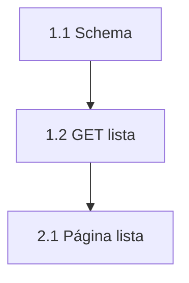

# Templates de Descrição de Tarefa

## Tom professor (lembrar sempre)

Toda task segue o padrão da skill: **explicar tintim por tintim para júnior**.  
Incluir glossário, tabela de colunas, DBML, exemplos e “por quê” — ver seção 🎓 no `SKILL.md`.  
**Não** enxugar isso no template.

---

## Aviso de IA (sempre no topo)

```markdown
> ⚠️ Esta tarefa foi estruturada com auxílio de Inteligência Artificial com base nas informações fornecidas. Embora o conteúdo tenha sido organizado para facilitar o entendimento, podem existir interpretações incorretas ou incompletas. Em caso de dúvida, valide com o solicitante antes de iniciar o desenvolvimento.
```

---

## Cabeçalho em grid (obrigatório)

Colar **logo após** o aviso de IA. Só campos úteis ao dev. **Nunca** incluir modo SuperAgente / complexidade de roteamento.

```markdown
# 🔗 [Título da Funcionalidade]

| | |
| --- | --- |
| **Projeto** | {nome do produto} |
| **Camadas** | Frontend + Backend |
| **Repositório Frontend** | [org/repo-front](https://github.com/…) |
| **Repositório Backend** | [org/repo-back](https://github.com/…) |
| **API (Front)** | `NEXT_PUBLIC_API_URL` → `https://…` (ver `.env.example` do front) |
| **Env Backend** | Criar/atualizar `.env.example` do back com as keys da seção Backend |
| **Protótipo** | [URL](https://...) |
| **Diagrama DB** | [dbdiagram](https://...) |
| **Contrato API (Apidog)** | [URL do docs deste produto](https://…) → pasta **…** |
```

Omite a linha do repo que não se aplica (só Front ou só Back).

---

## Template — SuperAgente / Direto pro Dev (corpo igual)

O **modo** (SuperAgente vs direto) decide-se no chat. O markdown entregue é o mesmo padrão abaixo — **didático**, para o **dev júnior**.

```markdown
> ⚠️ Esta tarefa foi estruturada com auxílio de Inteligência Artificial com base nas informações fornecidas. Embora o conteúdo tenha sido organizado para facilitar o entendimento, podem existir interpretações incorretas ou incompletas. Em caso de dúvida, valide com o solicitante antes de iniciar o desenvolvimento.

# 🔗 [Título da Funcionalidade]

| | |
| --- | --- |
| **Projeto** | … |
| **Camadas** | Frontend + Backend |
| **Repositório Frontend** | [org/repo-front](https://github.com/…) |
| **Repositório Backend** | [org/repo-back](https://github.com/…) |
| **API (Front)** | `NEXT_PUBLIC_API_URL` → `https://…` |
| **Env** | Front: `.env.example` · Back: criar/atualizar `.env.example` (keys na seção Backend) |
| **Protótipo** | [URL](https://…) |
| **Diagrama DB** | [URL](https://…) |
| **Contrato API (Apidog)** | [URL do docs deste produto](https://…) → pasta **…** |

---

## 📌 Contexto

[Dor / situação atual.]

### Glossário

| Termo | Significado em português simples |
| --- | --- |
| … | … |

---

## 🎯 Objetivo

[Resultado esperado em 1-2 frases.]

---

## 🔧 Alterações Necessárias

### 🖥️ Backend

#### 1. Schema — o que é cada coluna

| Coluna | Tipo | Para que serve |
| --- | --- | --- |
| … | … | … |

#### 2. DBML (colar no dbdiagram.io)

```dbml
// bloco completo com Notes
```

#### 3. [Endpoints / payloads / helpers]

[Exemplos curl, tabelas se X então Y, pseudocódigo.]

#### 4. Variáveis de ambiente / `.env.example`

```bash
KEY=
```

---

### 🖥️ Frontend

**Visual (não inverter):** 1) chrome **deste** repo  2) DS só no buraco (`design-system.md`, sem resumir)  3) protótipo = campos/ações — zero neon/glow.

#### 1. [Telas / campos / comportamentos]

#### 2. API base

Usar `NEXT_PUBLIC_API_URL` (valor no grid).

---

## 🖼️ Referência visual

**Protótipo:** [Nome — URL](https://exemplo.lovable.app/rota)

### [Tela]


---

## ✅ Critérios de Aceitação

### 🖥️ Backend

**BE-1: …**

- **Dado** …
- **Quando** …
- **Então** …

### 🖥️ Frontend

**FE-1: …**

- **Dado** …
- **Quando** …
- **Então** …

---

## Passo a passo sugerido

**Só Esteira** (Ritter). Imediatas: **omitir** esta seção inteira — a quebra é checklist nativo do ClickUp, não PBI.

Quadro-resumo se 4+ PBIs. Depois mermaid: **imagem** + fonte (SuperAgente). Molde: evidencias-dod.md


Código do diagrama (SuperAgente):



#### PBI 1 — Fundação Back

| Nº | Camada | Task | Espera | Bloqueia |
| --- | --- | --- | --- | --- |
| 1.1 | BACK | Schema / migration | - | 1.2, 2.1 |
| 1.2 | BACK | GET da listagem | 1.1 | 2.1 |

**Por quê**

- **1.1** bloqueia 1.2 e 2.1: sem schema o GET e a lista não existem
- **1.2** espera 1.1: SELECT nas colunas novas · bloqueia 2.1: a tabela consome este JSON

---

#### PBI 2 — Lista

| Nº | Camada | Task | Espera | Bloqueia |
| --- | --- | --- | --- | --- |
| 2.1 | FRONT | Página de lista | 1.2 | 2.2 |
| 2.2 | FRONT | Excluir na linha | 2.1 | - |

**Por quê**

- **2.2** espera 2.1: o botão mora na tabela

---

## REGRAS DE DDD

**Pronto:** **Faça login** no papel certo em HML. [o que executar — Dado/Quando/Então]. Sem “Imagine”.

**Paralelos:** **Confirme em HML** [telas/rotas/tipos]. Cada um = ação (abra / dispare / confira).

**Prova:** Front — **grave** em HML + o que fez. Back — **anexe** curl/contrato + doc se a spec pediu. Sem anexo = não entregue.

---

## ⚠️ Observações

- [Risco, dependência, env, edge case, o que o protótipo mente]

---

## ⛔ NÃO DEVE

> **BLOQUEIO.** Se qualquer linha abaixo for verdade, a entrega **não** está pronta — mesmo que o caminho feliz “pareça ok”. Não negociar. Não “quase pronto”.

| Se isto acontecer | Por que é falha |
| --- | --- |
| [ação concreta desta spec] | [por que é falha — uma frase] |

> **Frase de ouro.** [pronto de verdade desta entrega.] Qualquer linha da tabela = **não** está pronto.
```

---

## Template — Direto pro Dev (Imediatas)

Mesmo detalhe didático do template acima **exceto**:

- **Sem** `## Passo a passo sugerido` (sem PBI, sem Espera/Bloqueia, sem Dependência)
- **Sem** `## 🚀 Ordem de Execução` e **sem** `- [ ]` no markdown
- A ordem que o dev tica é o **checklist nativo** do ClickUp na tarefa dele (pai se uma camada; subtask Back/Front se as duas)

---

## Template — Só Backend ou Só Frontend

Mesmo template; omitir a seção da camada ausente e a linha do repo correspondente no grid. Manter Critérios só da camada envolvida. **Manter** glossário/colunas/DBML se a camada for Backend.

---

## Dicas de qualidade

| Elemento | Bom | Ruim |
|----------|-----|------|
| Tom | Professor: explica o porquê + exemplo | “Implementar conforme protótipo” |
| Cabeçalho | Grid com links dos repos + API URL | “Modo SuperAgente…” / complexidade |
| Schema | Coluna + “para que serve” + DBML | Só `CREATE TABLE` sem explicação |
| Payload | Formato completo com tipos | "Enviar os dados do cadastro" |
| Env | Keys no `.env.example` + placeholder | Secret real colado na task |
| Critério | Dado/Quando/Então por camada | "Deve funcionar corretamente" |
| DDD | Pronto + paralelos + prova HML | "Testar no final" |
| Passo a passo | Esteira: tabela 5 colunas + Por quê + mermaid duplo. Imediatas: **omitir**; checklist nativo no ClickUp | "Ver ordem no chat" / `- [ ]` no markdown da Imediata |
| Front | Campo + print com legenda; visual **repo → DS → mock** | "Ajustar a tela" / copiar neon do Lovable |
| UI | Legenda + URL space-assets; chrome do produto | Caminho `C:\...`; hex do mock |
| Tamanho | Longo e claro | Curto e ambíguo |
